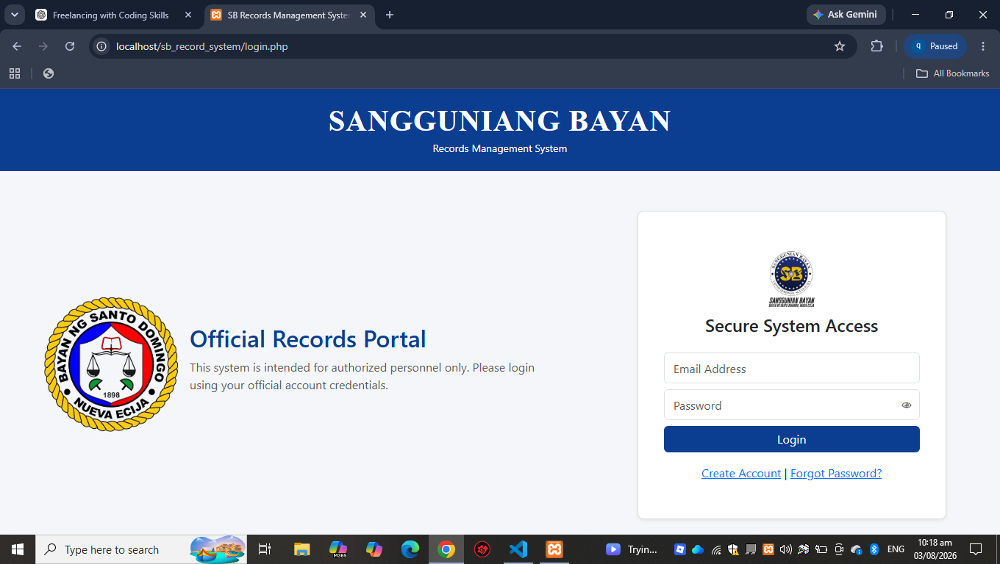
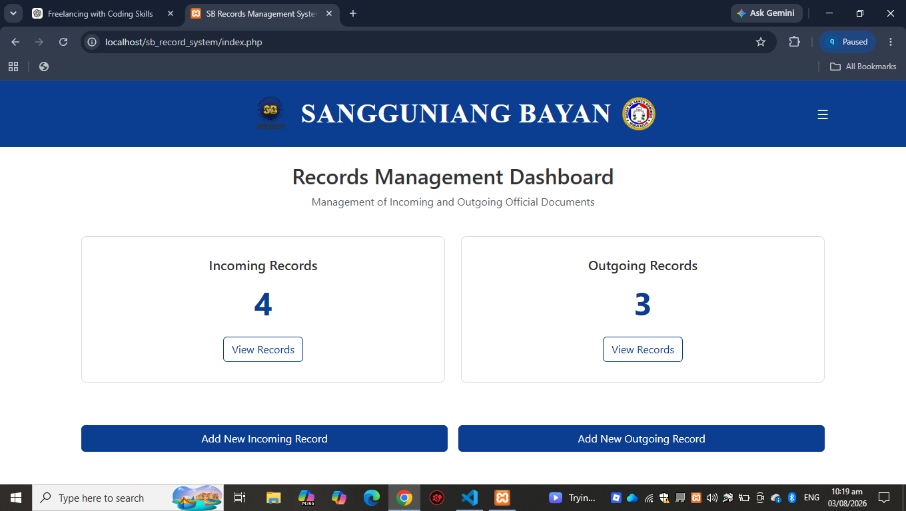
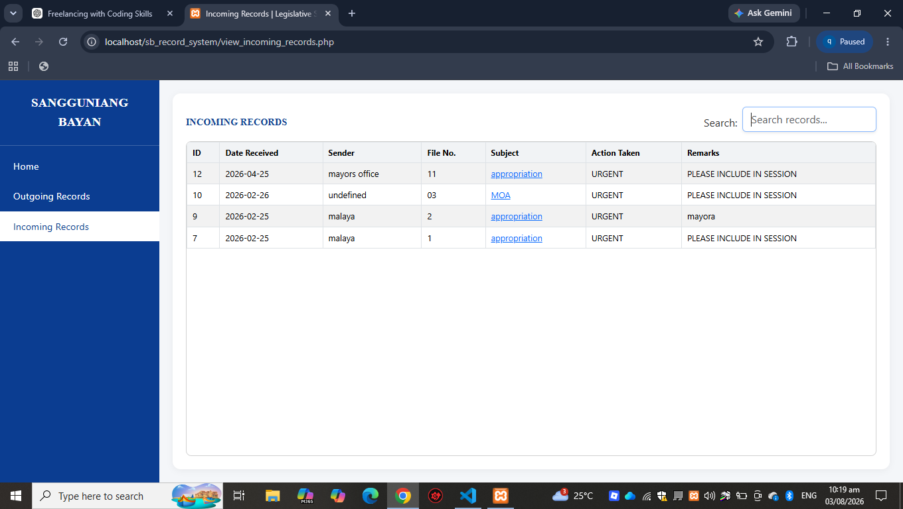
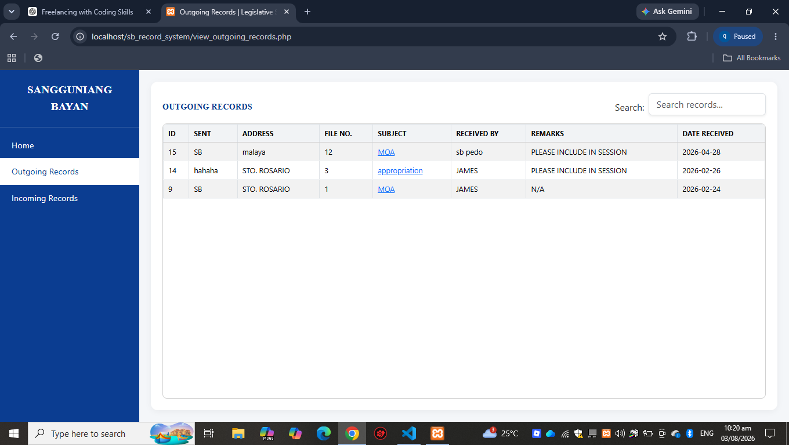
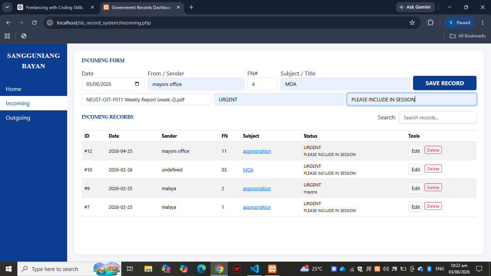
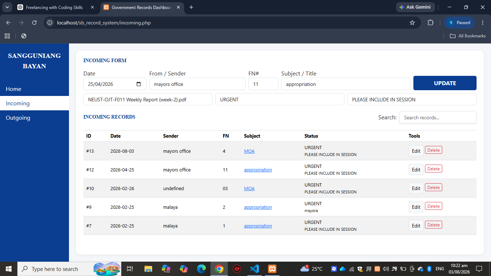
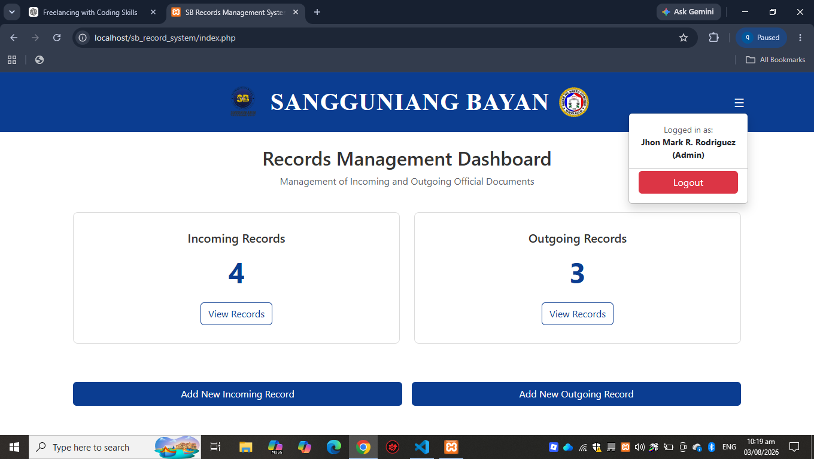
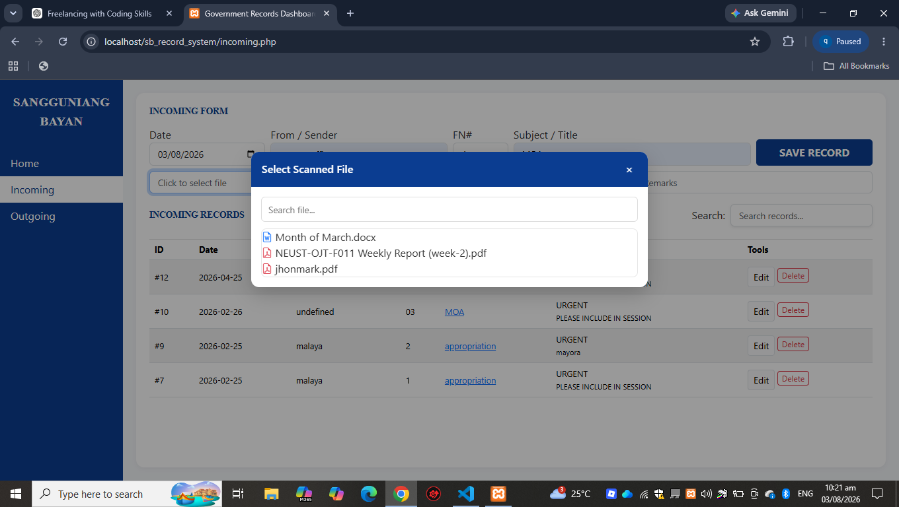

# SB Records Management System

## Sangguniang Bayan Records Management System

A web-based **Records Management System** designed for the **Sangguniang Bayan (SB)** to organize, manage, search, and monitor incoming and outgoing official documents.

The system provides a centralized digital platform for recording documents, linking scanned files, managing users, and maintaining an organized record of transactions.

---

## 📌 Project Overview

The **SB Records Management System** was developed to help improve the management of official records within the Sangguniang Bayan office.

Instead of relying entirely on manual logbooks and physical records, the system allows authorized users to digitally record and retrieve incoming and outgoing documents.

The system includes document management, search functionality, user authentication, role-based access, scanned-document linking, and dashboard statistics.

---

## ✨ Features

### 🔐 User Authentication

* User login
* User registration
* Forgot password functionality
* Session-based authentication
* Role-based access control
* Admin and regular-user permissions

### 📥 Incoming Records

* Add incoming documents
* View incoming records
* Edit existing records
* Delete records
* Search incoming records
* Link scanned documents
* Track document information

### 📤 Outgoing Records

* Add outgoing documents
* View outgoing records
* Edit existing records
* Delete records
* Search outgoing records
* Link scanned documents

### 📁 Scanned Document Management

* Browse scanned document folders
* Select scanned files
* Link files to records
* Open linked documents
* Supports locally stored scanned documents

### 🔎 Search System

* Search records using multiple keywords
* Search across relevant record fields
* Real-time filtering
* Helps users quickly locate documents

### 📊 Dashboard

* Total incoming records
* Total outgoing records
* System statistics
* Quick access to record-management functions

### 👥 User Management

* User accounts
* User roles
* Administrator access control
* Restricted administrative functions for regular users

### 🛡️ Access Control

* Protected pages
* Session verification
* Admin-only functions
* Controlled access to record-management operations

---

## 🛠️ Technologies Used

| Technology  | Purpose                            |
| ----------- | ---------------------------------- |
| PHP         | Backend and server-side processing |
| MySQL       | Database management                |
| HTML5       | Website structure                  |
| CSS3        | Interface styling                  |
| JavaScript  | Interactive functions              |
| Bootstrap 5 | User interface components          |
| XAMPP       | Local development environment      |
| Git         | Version control                    |
| GitHub      | Source code repository             |

---

## 🗄️ Database

The system uses **MySQL** as its database management system.

### Database

```text
sb_incoming
```

### Main Tables

```text
in_info
out_info
```

### Incoming Records

The incoming records table stores information such as:

```text
id
DATE_RECIEVER
SENDER
FN INT
SUBJECT
ACTION_TAKEN
REMARKS
SUBJECT_LINK
```

### Outgoing Records

The outgoing records table stores information related to documents released or sent by the office.

---

## 📂 Project Structure

A simplified project structure is shown below:

```text
sb-records-management-system/
│
├── index.php
├── login.php
├── signup.php
├── forgot_password.php
│
├── dashboard.php
├── incoming.php
├── outgoing.php
│
├── config.php
├── db_connect.php
├── logout.php
│
├── css/
│   └── style.css
│
├── js/
│   └── script.js
│
├── scanned_docs/
│   ├── incoming/
│   └── outgoing/
│
├── screenshots/
│   ├── adding-records.png
│   ├── admin-dashboard.png
│   ├── edit-or-update.png
│   ├── incoming-dashboard.png
│   ├── login.png
│   ├── outgoing-dashboard.png
│   ├── role.png
│   ├── scanned-file-selection.png
│   └── search.png
│
└── README.md
```

> The actual file structure may vary depending on the current version of the project.

---

## 💻 System Requirements

Before running the system, make sure the following are installed:

* Windows
* XAMPP
* Apache
* MySQL
* PHP
* Web browser
* Git (optional)

Recommended browsers:

* Google Chrome
* Microsoft Edge
* Mozilla Firefox

---

## ⚙️ Installation

### 1. Install XAMPP

Install XAMPP on your computer.

Start the following services from the XAMPP Control Panel:

```text
Apache
MySQL
```

---

### 2. Copy the Project

Copy the project folder into the XAMPP `htdocs` directory.

Example:

```text
C:\xampp\htdocs\sb-records-management-system
```

---

### 3. Create the Database

Open:

```text
http://localhost/phpmyadmin
```

Create a database named:

```text
sb_incoming
```

---

### 4. Import the Database

Import the project's SQL database file into the newly created database.

Make sure the required tables are available, including:

```text
in_info
out_info
```

---

### 5. Configure the Database Connection

Open the database configuration file, such as:

```text
db_connect.php
```

or:

```text
config.php
```

Set the database connection according to your local XAMPP configuration.

Example:

```php
$host = "localhost";
$user = "root";
$password = "";
$database = "sb_incoming";
```

---

### 6. Open the System

Open your web browser and go to:

```text
http://localhost/sb-records-management-system/
```

The login page should appear.

---

## 👤 User Roles

### Administrator

The administrator can access administrative functions such as:

* Add incoming records
* Add outgoing records
* Edit records
* Delete records
* Manage system data
* Access restricted administrative functions

### Regular User

Regular users can access permitted system functions without administrative privileges.

Administrative functions are restricted to authorized administrators.

---

## 🔎 Searching Records

The system supports keyword-based searching.

Users can enter multiple keywords to narrow down results and quickly locate specific records.

Example:

```text
budget 2026
```

The search function helps users locate matching records efficiently.

---

## 📁 Scanned Documents

Scanned documents can be stored inside the project's document directory.

Example:

```text
scanned_docs/
```

The system includes a file-selection interface that allows users to browse available files and associate a scanned document with a record.

This allows users to quickly access the digital copy of an official document from its corresponding record.

---

## 🔒 Security Features

The system includes several basic security mechanisms:

* Session authentication
* Login protection
* Role-based access
* Admin authorization checks
* Protected pages
* File path validation
* Hidden-file protection
* Confirmation before deleting records

For production deployment, additional security measures should be implemented, including stronger password policies, HTTPS, secure file storage, CSRF protection, and additional input validation.

---

# 📸 Screenshots

The following screenshots demonstrate the main features and interfaces of the SB Records Management System.

---

## 🔐 Login

The login interface provides authorized users with access to the system through their registered credentials.



---

## 📊 Administrator Dashboard

The administrator dashboard provides an overview of the system and access to the available management functions.



---

## 📥 Incoming Records Dashboard

The incoming records dashboard displays documents received by the Sangguniang Bayan office.



---

## 📤 Outgoing Records Dashboard

The outgoing records dashboard displays documents released or sent by the office.



---

## ➕ Adding Records

The system provides forms for adding new incoming and outgoing records.



---

## ✏️ Edit or Update Records

Existing records can be modified or updated when necessary.



---

## 👥 User Roles

The system uses role-based access to control which functions are available to different users.



---

## 📁 Scanned File Selection

Users can browse and select scanned documents to associate with a specific record.



---

## 🔎 Search Function

The search functionality allows users to quickly locate records using keywords.


---

# 📷 Additional Screenshots

Additional screenshots can be added to this section to demonstrate other system features, pages, functions, or interfaces that are not included in the main screenshots above.

When adding a new screenshot, upload it to the `screenshots` folder and add it using the following format:

```markdown
## Screenshot Title

Brief description of what the screenshot demonstrates.


```

This section can be used for future screenshots such as:

* User registration
* Forgot password
* Delete confirmation
* Document preview
* Navigation menu
* System notifications
* Database-related features
* Other system interfaces

---

## 🎯 Objectives

The system aims to:

1. Digitize the recording of incoming and outgoing documents.
2. Reduce dependence on manual record-keeping.
3. Improve document organization.
4. Provide faster record searching and retrieval.
5. Provide easier access to scanned documents.
6. Control access through user authentication and roles.
7. Improve the efficiency of records management within the Sangguniang Bayan office.

---

## 🚀 Future Improvements

Possible future improvements include:

* Advanced audit logs
* User activity tracking
* Document download monitoring
* Document printing logs
* PDF report generation
* Excel report generation
* Automated database backups
* Improved document preview
* Document categorization
* Advanced user management
* Notification system
* Cloud or network-based deployment
* Enhanced security controls

---

## 📚 Project Purpose

This project was developed as an Information Technology project to demonstrate the practical application of:

* Web development
* Database management
* User authentication
* CRUD operations
* File management
* Search functionality
* Access control
* Records management

The system is intended to provide a practical digital solution for managing Sangguniang Bayan records.

---

## 👨‍💻 Developer

**Jhonmark Rodriguez**

BS Information Technology
Network Systems Technology

---

## 📄 License

This project is intended for educational and organizational purposes.

---

## ⭐ Project Status

**Status: Completed**

The current version includes the core records-management functions, authentication, database integration, search functionality, scanned-document linking, dashboard, and role-based access control.
