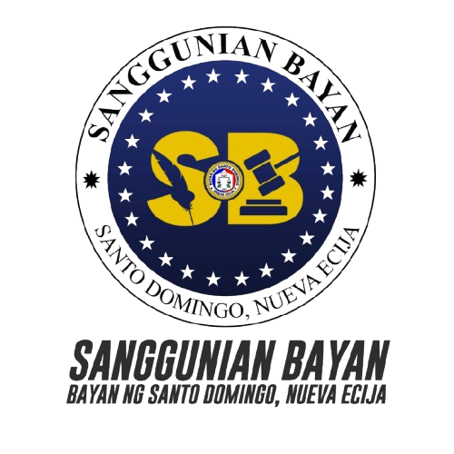

# SB Records Management System

A web-based records management system developed to organize, manage, and monitor incoming and outgoing documents.

## Project Overview

The SB Records Management System provides a centralized platform for managing records digitally instead of relying entirely on manual record keeping.

The system allows authorized users to manage records, search documents, and access important information through a web-based interface.

## Features

* User Login and Authentication
* Incoming Records Management
* Outgoing Records Management
* Add, Edit, and Delete Records
* Search and Record Filtering
* Dashboard
* Document/File Management
* Organized Record Viewing
* Responsive User Interface

## Technologies Used

* PHP 8
* MySQL
* HTML5
* CSS3
* JavaScript
* Bootstrap
* XAMPP

## Development Tools

* Visual Studio Code
* XAMPP
* MySQL
* Git
* GitHub

## My Role

**Full-Stack Developer**

I designed and developed the database structure, backend functionality, user interface, and record management features of the system.

## Purpose

The system was developed to improve the organization and accessibility of records by providing a centralized digital record management platform.

## Screenshots

### Login

### Dashboard

### System Interface

## Note

This repository contains a portfolio version of the project. Sample data is used for demonstration purposes, and sensitive credentials and private documents are excluded.
